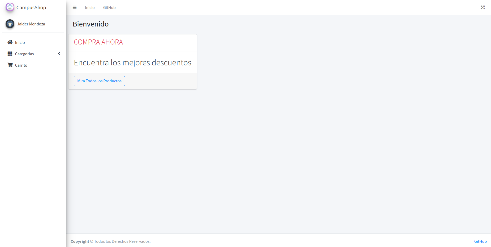
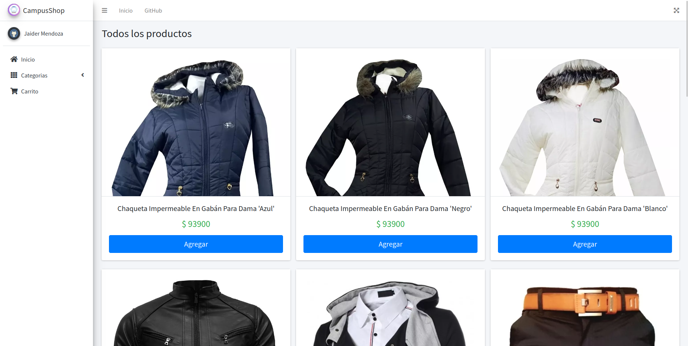
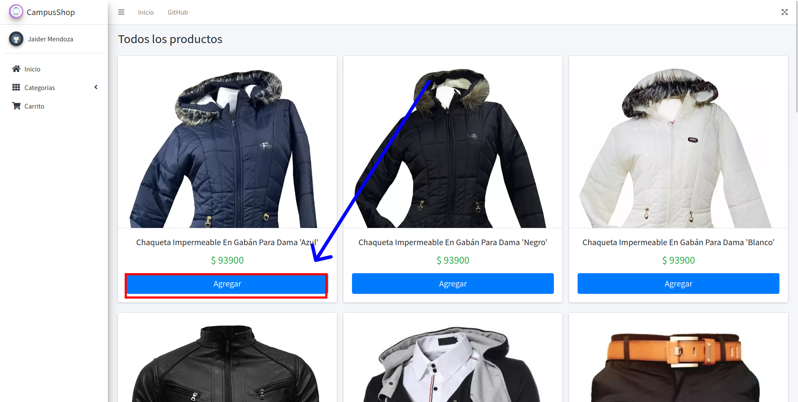
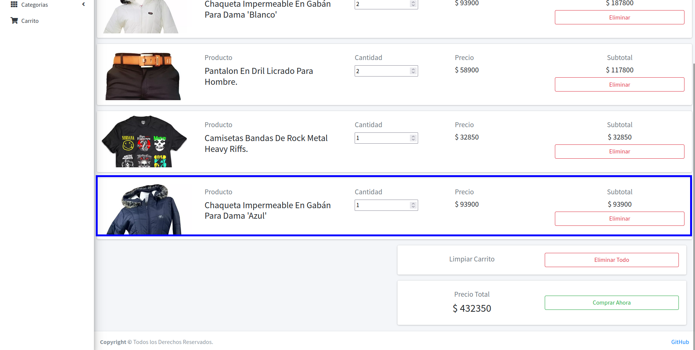
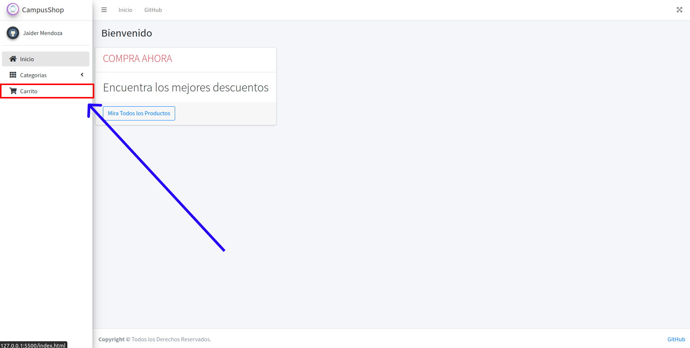
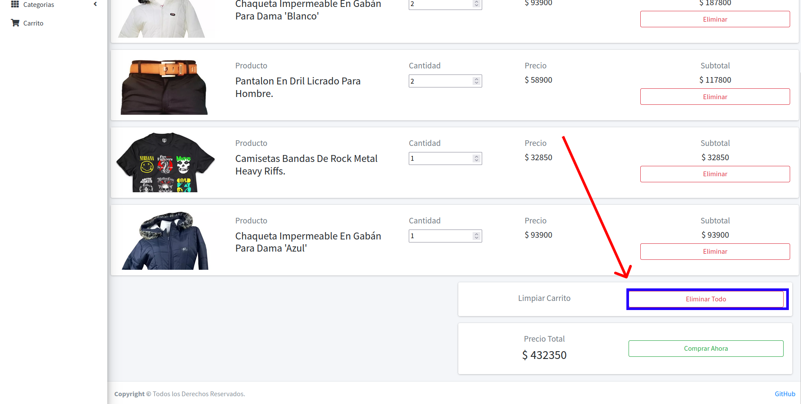
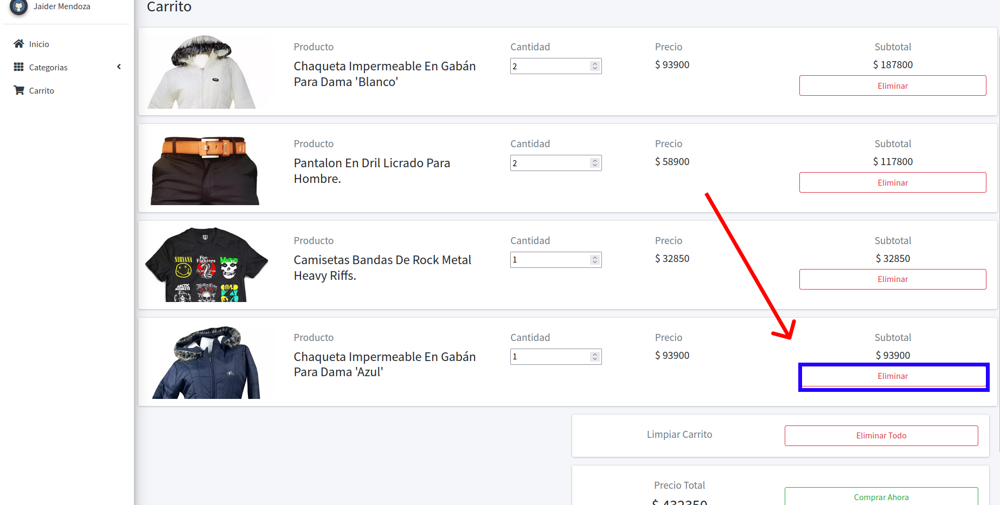
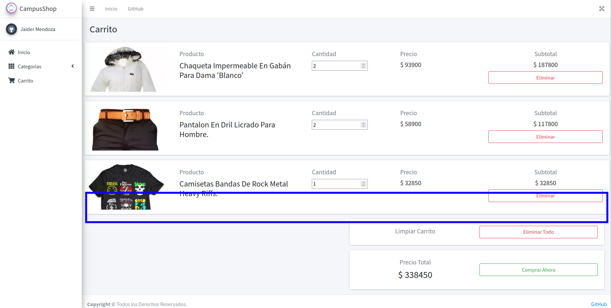
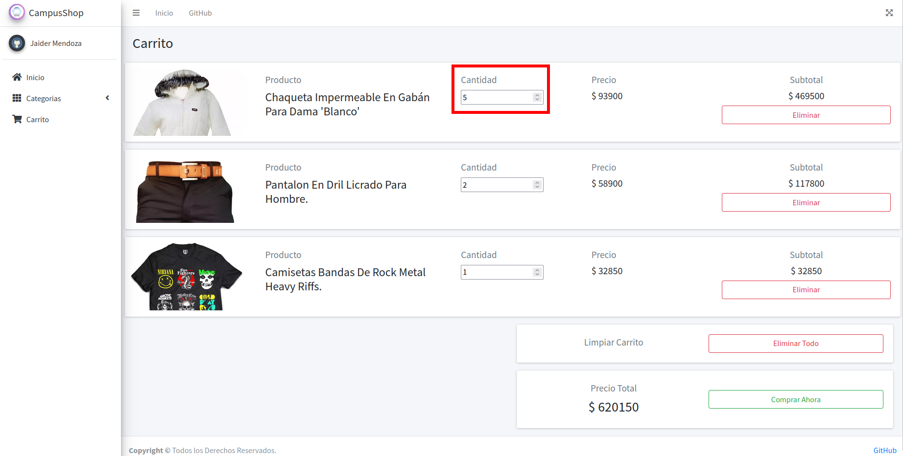

## Autor
- [Jaider Steeven Mendoza Cardona](https://github.com/Dabrox02)

# Proyecto Campus Shop
Este proyecto consiste en la integración de las tecnologias aprendidas con el fin de crear una aplicacion web e-commerce, usando json-server como api.
****
## Tecnologias utilizadas
Para la concepción del proyecto se hizo uso de las siguientes tecnologias, las cuales se integraron para crear el proyecto:
****
- HTML (HyperText Markup Language)
- CSS (Cascading Style Sheets)
- Bootstrap
- JavaScript
- [Json-Server](https://github.com/typicode/json-server)

## Requisitos Minimos
Hay algunos requisitos y consideraciones que el cliente debe tener en cuenta para garantizar una implementación exitosa de la aplicación web:

- Acceso a Internet
- Dispositivo Compatible
- Navegador Compatible:
  - [Mozilla Firefox](https://www.mozilla.org/es-ES/firefox/new/)
  - [Google Chrome](https://www.google.com/chrome/)

****
## Estructura del Proyecto
```
+---api           // Logica de la API
|   +---crud
|   +---data
|   +---models
|   +---util
|   \---config.js
+---assets        // Assets de la aplicación
|   +---img
|   \---css
|       \---tabla
+---components    // Componentes Generales
|   +---footer-component
|   +---header-component
|   +---sidebar-component
|   +---product-component
|   +---product-cart-component
|   \---swal-alert
+---modules       // Logica del Negocio
+---readmeAssets  // Assets para Readme
|
+---index.html
+---index.js
+---app.js
+---config.js
+---.gitignore
+---package.json
+---README.md
```

****
## Guía de Instalación y Configuración de json-server
### Requisitos previos:
- **NVM** es una herramienta que te permite administrar múltiples versiones de Node.js en tu máquina.

**Instalación de NVM en Linux y macOS**
1. Abre tu terminal.
2. Utiliza `curl` o `wget` para descargar el script de instalación de NVM desde el repositorio oficial de GitHub. Puedes usar uno de los siguientes comandos:

   Utilizando `curl`:

   ```bash
   curl -o- https://raw.githubusercontent.com/nvm-sh/nvm/v0.39.5/install.sh | bash
   ```

   Utilizando `wget`:

   ```bash
   wget -qO- https://raw.githubusercontent.com/nvm-sh/nvm/v0.39.5/install.sh | bash
   ```

   Asegúrate de verificar la URL en el comando con la versión actual de NVM en [GitHub](https://github.com/nvm-sh/nvm).

3. Después de ejecutar el comando, seguirás las instrucciones en la terminal para completar la instalación.

4. Cierra y vuelve a abrir tu terminal o ejecuta `source ~/.bashrc` o `source ~/.zshrc` (dependiendo de tu shell) para cargar NVM en tu sesión actual.

***
**Uso de NVM**

Una vez instalado NVM, puedes usar los siguientes comandos para gestionar las versiones de Node.js en tu sistema:

- Para instalar una versión específica de Node.js, por ejemplo, Node.js ultima version estable:
  ```bash
  nvm install --lts
  ```
- Para seleccionar una versión específica de Node.js para usar:

  ```bash
  nvm use <version>
  ```
Recuerda consultar la [documentación oficial de NVM](https://github.com/nvm-sh/nvm) para obtener más detalles y opciones de configuración avanzadas.
***

## Instalación json-server

Abre tu terminal y ejecuta el siguiente comando para instalar `json-server`:

```bash
npm install -E -D json-server
```

Esto instalará `json-server` con la ultima version estable de acuerdo a nuestra versión de Node.js

## Ejecución de json-server

**Inicia json-server:**
En tu terminal, ejecuta `json-server` y especifica el archivo JSON que deseas utilizar como fuente de datos:

```bash
json-server --watch db.json --port <port>
```
<a name="clonar-repositorio"></a>

## Clonar este Repositorio

Para clonar este repositorio debes tener instalada la herramienta de [**GIT**](https://git-scm.com/), y ejecutar el siguiente comando:

```bash
git clone https://github.com/Dabrox02/CampusShop.git
```

_Debes tener permisos para clonar este repositorio_

## Inicializacion del proyecto
[**Si clonas este repositorio**](#clonar-repositorio), debes utilizar el siguiente comando para instalar las dependencias necesarias:
```bash
npm install
```

Una vez instaladas, para ejecutar el json-server con la configuracion antes mencionada utiliza el siguiente comando:
```bash
npm run dev
```

Esto iniciará `json-server` y lo configurará para escuchar en el puerto `5310` y host 127.0.0.1. 
```
json-server --watch api/data/db.json --port 5310 --routes api/data/routes.json --host 127.0.0.1
```

Ahora, la API REST simulada estará disponible en `http://localhost:5010`.


## Inicializacion de la aplicación
Una vez instaladas las depedencias y ejecutado el json-server, esta listo para usar la aplicación, puedes usar un servidor local como [Live-Server](https://marketplace.visualstudio.com/items?itemName=ritwickdey.LiveServer).

### Vista Inicial
<div align="center">
  
</div>

Encontraras en la parte izquierda un menu lateral para ir a las otras secciones de la pagina:
    
- Inicio
- Categorias
  - Todos los productos
  - Abrigos
  - Pantalones
  - Camisetas
- Carrito

Y un menu superior para navegar al inicio y al GitHub del creador. En ambos podras navegar al inicio.

## Uso de la Aplicación
La aplicacion posee las siguientes funciones
- Agregar al carrito de compra
- Eliminar todo el carrito
- Eliminar un producto del carrito
- Editar cantidad producto

### Como Agregar un producto al carrito
Ingrese a una seccion de productos, seleccione el producto que desea agregar y posteriormente de clic en el boton **AGREGAR**, automaticamente sera añadido al carrito y podra verlo en la seccion **CARRITO**. 

<div align="center">
  <h3>Paso 1</h3>
  
  <h3>Paso 2</h3>
  
  <h3>Resultado</h3>
  
</div>


### Como Eliminar todo el carrito
Ingrese a la seccion de **CARRITO** y en la parte inferior seleccione el boton **ELIMINAR TODAS**, si la operacion es correcta sera eliminado.

<div align="center">
  <h3>Paso 1</h3>
  
  <h3>Paso 2</h3>
  
  <h3>Resultado</h3>
  
</div>


### Como Eliminar un producto
Ingrese a la seccion de **CARRITO**, seleccione el producto que desea eliminar, y de clic en el boton **ELIMINAR**, correspondiente a dicho producto. Si la operacion es correcta, sera eliminado el producto.

<div align="center">
  <h3>Paso 1</h3>
  
  <h3>Paso 2</h3>
  
  <h3>Resultado</h3>
  
</div>

### Como Editar cantidad de un producto
Ingrese a la seccion de **CARRITO**, seleccione el producto que desea editar, en el campo **CANTIDAD**, modifique la cantidad que desea comprar. _Si das clic en agregar y el producto ya esta agregado, tambien se añade uno mas._


<div align="center">
  <h3>Paso 1</h3>
  
  <h3>Paso 2</h3>
  
  <h3>Resultado</h3>
  
</div>

### 🐰 Comprar Ahora
Si das clic en **COMPRAR AHORA**, mostrara un modal con el mensaje _COMPRADO CON EXITO_, y se limpiara el carrito. 

<div align="center">
  
</div>